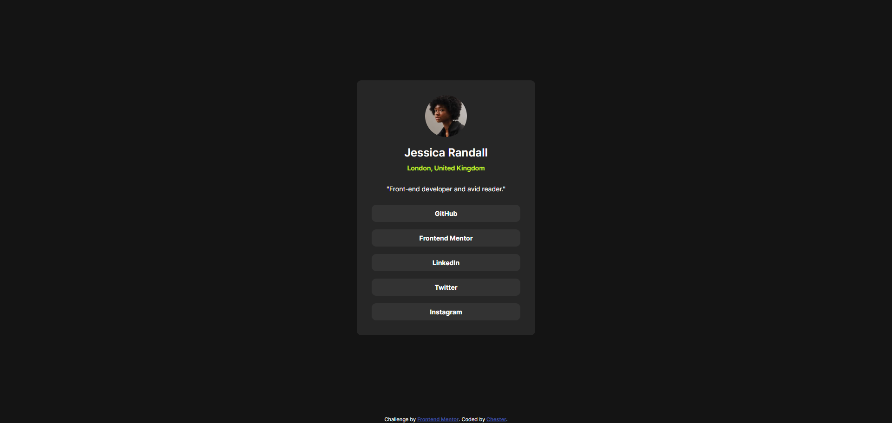

# Frontend Mentor - Social links profile solution

This is a solution to the [Social links profile challenge on Frontend Mentor](https://www.frontendmentor.io/challenges/social-links-profile-UG32l9m6dQ). Frontend Mentor challenges help you improve your coding skills by building realistic projects. 

## Table of contents

- [Overview](#overview)
  - [The challenge](#the-challenge)
  - [Screenshot](#screenshot)
  - [Links](#links)
- [My process](#my-process)
  - [Built with](#built-with)
  - [What I learned](#what-i-learned)
  - [Continued development](#continued-development)
  - [Useful resources](#useful-resources)
- [Author](#author)

## Overview

### The challenge

Users should be able to:

- See hover and focus states for all interactive elements on the page

### Screenshot




### Links

- Solution URL: [Add solution URL here](https://www.frontendmentor.io/solutions/responsive-profile-card-component-using-css-media-query-hHWMdA6KJX)
- Live Site URL: [Add live site URL here](https://social-links-profile-main-sigma-two.vercel.app/)

## My process

### Built with

Semantic HTML5 markup
CSS custom properties
Flexbox
Mobile-first workflow
Custom font setup using @font-face
Hover interaction for link buttons

### What I learned

Working on this project helped me improve my understanding of:
Semantic HTML structure, especially using <header>, <nav>, and <figure> correctly.
Accessibility, such as using aria-label on the navigation and descriptive alt text for the avatar.
Using @font-face properly to load multiple font weights under the same family.
Centering content using CSS Grid’s place-items: center.
Creating accessible, button-like links with consistent hover states.

Here is one of the CSS snippets I'm proud of:

```css
nav li a {
  background-color: var(--clr-Grey-700);
  border-radius: calc(var(--border-radius) * 2);
  color: var(--clr-White);
  font-family: var(--ff-inter);
  font-weight: var(--fw-700);
  transition: 0.3s ease;
}

nav li a:hover {
  background-color: var(--clr-Green);
  color: var(--clr-Grey-900);
}
```
### Continued development
In future projects, I want to continue focusing on:
Improving accessibility through ARIA attributes.
Writing cleaner, more scalable CSS with component-based structure.
Strengthening layout skills using both Flexbox and Grid.
Loading custom fonts more efficiently.


## Author

- Frontend Mentor - [@Chester1103](https://www.frontendmentor.io/profile/Chester1103)
- Github - [@Chester1103](https://github.com/Chester1103)
